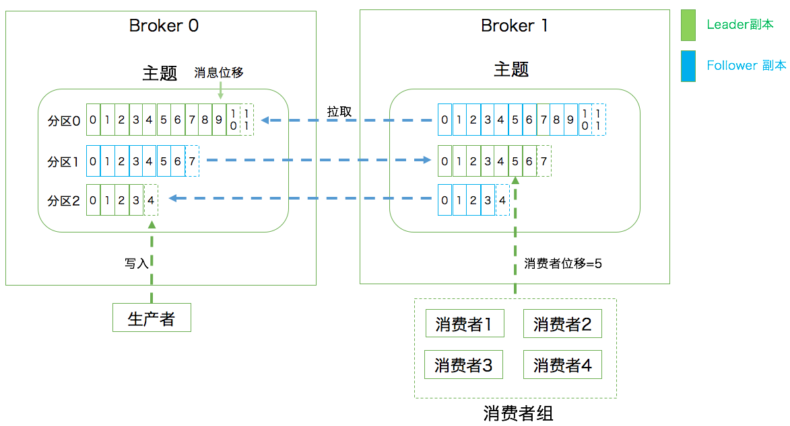

## 基本概念

### Kafka是什么？

[官网](https://kafka.apache.org/documentation/) 开头就详细的介绍了事件流以及Kafka的作用。照例，我简单总结下。首先官网解释了什么是事件流（Event Streaming），即实时地从事件源（如数据库、传感器、移动设备、云服务和软件应用程序等）获取数据。从字面上，可以形象的理解为一条数据的河流，实时地、有方向的流动。

Kafka正是一个处理这些事件流的平台，作为平台它有如下几个重要功能：

- 发布（写入）和订阅（读取）事件流，包括从其他系统持续导入、导出数据。
- 可以存储数据。

- 实时或非实时地处理数据。

我们再分别解释一下上述的几个作用。第一个，也是我们最常用的场景，就是把Kafka当一个MQ使用。

第二个，可以存储数据，因为Kafka不是一个一对一的消息管道，而是可以多对多的，具有订阅发布模型的消息引擎。在这种情况下，Kafka必须要存储部分消息数据，不然无法满足多个消费者都可以接收数据的要求。

第三个，也就是Kafka的流处理（Kafka Streams），这个常见于大数据处理。不过目前Spark和Flink的市场占有率更多一些，包括我们公司的大数据平台的流处理功能，都暂时没接入Kafka Streams。

所以总结一下，Kafka是个消息引擎系统，作用如上。不能单纯的把它当成消息队列，毕竟其他功能在哪摆着呢。

### 常见术语

- Broker：一个Kafka实例，启动一个Kafka就是一个Broker。不能完全当作一台服务器，不过实际中，一台服务器也只会部署一个Kafka实例。
- 消息：Record。Kafka 是消息引擎嘛，这里的消息就是指 Kafka 处理的主要对象，即实际业务中发送的数据。

- 主题：Topic。主题是承载消息的逻辑容器，在实际使用中多用来区分具体的业务。
- 分区：Partition。一个有序不变的消息序列。每个主题下可以有多个分区。

- 消息位移：Offset。表示分区中每条消息的位置信息，是一个单调递增且不变的值。
- 副本：Replica。Kafka 中同一条消息能够被拷贝到多个地方以提供数据备份，这些地方就是所谓的副本。副本还分为领导者副本和追随者副本，各自有不同的角色划分。副本是在分区层级下的，即每个分区可配置多个副本从而实现高可用。

- 生产者：Producer。向主题发布新消息的应用程序。
- 消费者：Consumer。从主题订阅新消息的应用程序。

- 消费者位移：Consumer Offset。表征消费者消费进度，每个消费者都有自己的消费者位移。
- 消费者组：Consumer Group。多个消费者实例共同组成的一个组，同时消费多个分区以实现高吞吐。

- 重平衡：Rebalance。消费者组内某个消费者实例挂掉后，其他消费者实例自动重新分配订阅主题分区的过程。Rebalance 是 Kafka 消费者端实现高可用的重要手段。



> 图片摘自《Kafka核心技术与实战》


## 快速开始

> 以下演示均为单机版，如果想玩集群可自行搜索相关配置，一般与单机版配置差距不大，通常需要填写集群中其他机器的IP。

### 操作系统

CentOS7

### JDK

JDK8

### ZK、Kafka版本

- Zookeeper 3.6.0
- Kafka_2.11-2.4.1

Kafka版本说明：zk的版本号很清楚，跟绝大部分软件一样。而Kafka的版本号是两个数字拼起来的，存在一定歧义，比如2.11-2.4.1。其中2.11代表Scala的版本，2.4.1才是Kafka的版本。Kafka正是由Scala编写的，其也是JVM系的一种编程语言。

### 下载、解压

```shell
# 下载zookeeper安装包
wget https://archive.apache.org/dist/zookeeper/zookeeper-3.6.0/apache-zookeeper-3.6.0-bin.tar.gz
tar -zxvf apache-zookeeper-3.6.0-bin.tar.gz
# 移至自己的工作目录
mv apache-zookeeper-3.6.0-bin /usr/zookeeper/

# 下载kafka
wget https://archive.apache.org/dist/kafka/2.4.1/kafka_2.11-2.4.1.tgz
tar -zxvf kafka_2.11-2.4.1.tgz
mv kafka_2.11-2.4.1 /usr/kafka
```

### 配置、启动

**首先配置、启动zookeeper**

```shell
#进入zookpeer的conf目录
cp zoo_sample.cfg zoo.cfg
vim zoo.cfg
```

zk的默认配置就可以启动了。但是其默认配置中数据和日志是同一目录，即只有dataDir配置，我们需要手动指定日志目录，即dataLogDir：

```shell
# zk服务器心跳间隔，单位ms
tickTime=2000
# 新leader初始化时间
initLimit=10
# leader与follower心跳检测最大容忍时间：tickTime*syncLimit
syncLimit=5
# 数据目录
dataDir=/tmp/zookeeper/data
# 日志目录
dataLogDir=/tmp/zookeeper/log
# 对外服务端口
clientPort=2181
```

如果你的系统中没有上述配置中的两个目录，记得手动创建一下：

```shell
mkdir -p /tmp/zookeeper/data
mkdir -p /tmp/zookeeper/log
# 启动zookeeper
/usr/zookeeper/bin/zkServer.sh start
# 查看zookeeper状态
/usr/zookeeper/bin/zkServer.sh status
```

**接着配置、启动Kafka**

```shell
# 修改配置文件
vim /usr/kafka/config/server.properties

# 需填写如下配置：
# 服务器编号，如果是集群模式，需要保证改编号唯一
broker.id=0
# kafka监听的ip和端口
listeners=PLAINTEXT://localhost:9092
# 如果是云服务部署的，需要外网访问，还需要如下配置，上面的localhost改成内网IP
# advertised.listeners=PLAINTEXT://公网IP:9092
# 日志目录
log.dirs=/tmp/kafka-logs
# zookeeper的ip和端口
zookeeper.connect=localhost:2181/kafka
```

保存退出后，启动Kafka：

```shell
/usr/kafka/bin/kafka-server-start.sh /usr/kafka/config/server.properties
```

## 快速实战

​	见代码。
